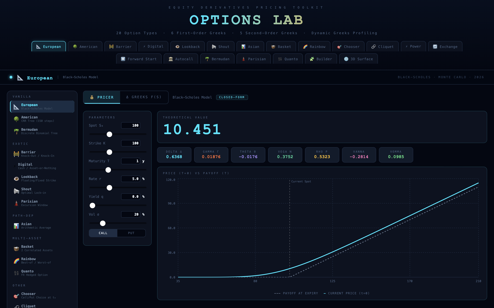
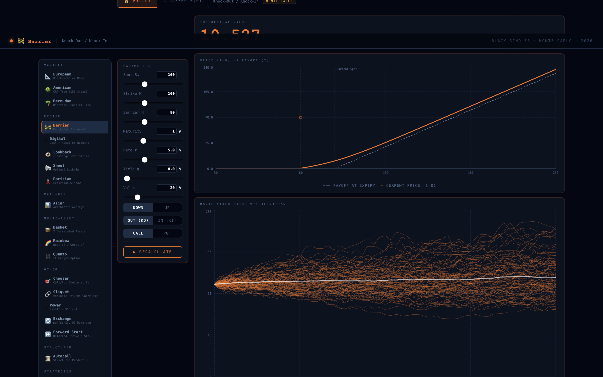
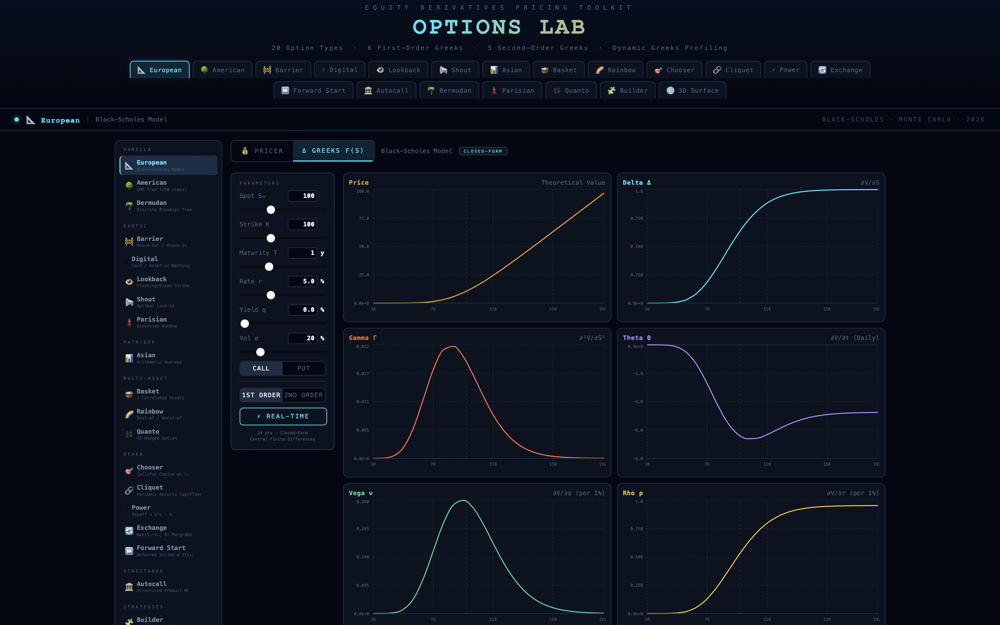
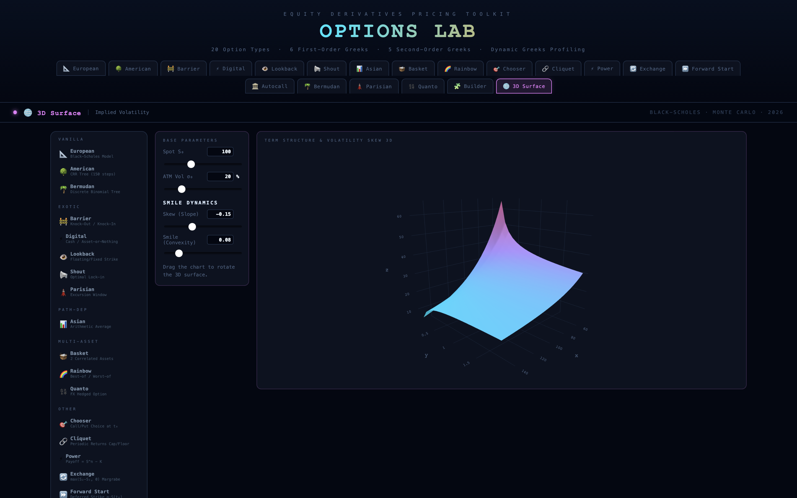

# 🧪 Options Lab: Applied Quantitative Finance Engine

**Options Lab** is an interactive, web-based quantitative finance toolkit designed for pricing equity derivatives, analyzing dynamic risk metrics (Greeks), and visualizing market models. Built entirely with React, it bridges advanced stochastic mathematical models with a high-performance front-end architecture.

🌍 **[Live Demo: Try Options Lab Here](https://equityderivativespricingtoolkit.netlify.app)**

---

## 📊 Visual Showcase

### 1. Dynamic Pricing & Payoff Profiling
Visualizing the Extrinsic Value (Time Value) by comparing the dynamic Current Price (t=0) against the Theoretical Payoff at maturity (T).


### 2. Advanced Monte Carlo Simulations
Stochastic path rendering and probabilistic distribution of payoffs for complex structured products like Autocalls and Barrier options.


### 3. Dynamic Risk Analytics (Greeks)
Real-time computation and visualization of 1st and 2nd-order Greeks across the underlying spot using Central Finite Differences.


### 4. Interactive 3D Volatility Surface
Parametric modeling of the Implied Volatility Skew and Term Structure, fully interactive in 3D.


*(Note: update the image paths in the markdown to match your actual file names)*

---

## ⚙️ Core Features & Mathematical Engine

* **Extensive Pricing Engine:** Implementation of closed-form solutions (Black-Scholes-Merton, Margrabe), CRR Binomial Trees, and Monte Carlo simulations for 20+ option types:
    * *Vanillas:* European, American, Bermudan.
    * *Exotics:* Barrier, Digital, Lookback, Asian, Parisian, Chooser, Cliquet, Power, Shout.
    * *Multi-Asset:* Basket, Rainbow, Exchange, Quanto.
    * *Structured Products:* Autocallables.
* **Risk Management (Greeks):** Accurate computation of Delta, Gamma, Theta, Vega, Rho, Vanna, Vomma, Charm, Speed, and Veta.
* **Interactive Strategy Builder:** Dynamic portfolio construction allowing the combination of multiple option legs (Call Spreads, Straddles, Iron Condors) to analyze aggregate payoffs and combined risk metrics.
* **Stochastic Path Rendering:** Simulation and visual tracking of underlying trajectories (Geometric Brownian Motion), including correlated multi-asset paths using Cholesky decomposition.

---

## 🚀 Tech Stack

* **Framework:** React.js
* **Data Visualization:** Recharts (2D profiling), Plotly.js (3D Surface rendering)
* **Math Engine:** Custom vanilla JavaScript implementation of stochastic calculus, normal distributions, and finite difference methods.

---

## 💻 Run Locally

To run this project on your local machine:

1. Clone the repository:
   ```bash
   git clone [https://github.com/YourUsername/options-lab.git](https://github.com/YourUsername/options-lab.git)
